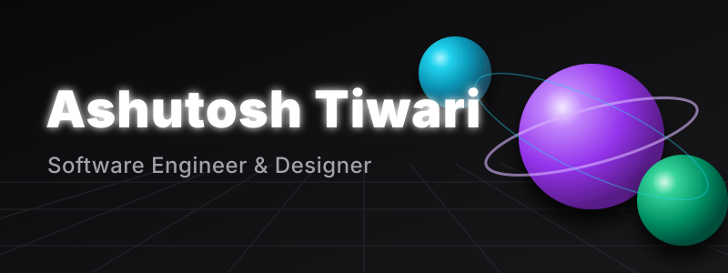

  

<h1 align="center">Exploring the next dimension of code. 🚀</h1>

  <em>Specializing in scalable backend systems and immersive, interactive web experiences.</em>

---

## 🔮 // my focus

I'm a **Software Engineer** who bridges the gap between deep technical architecture and striking visual design. When I'm not optimizing databases or writing robust APIs, I'm probably experimenting with 3D graphics on the web or building sleek, modern interfaces.

 

## 🛠️ // toolkit

<table>
  <tr>
    <td align="center" width="96">
      
       Javascript
    </td>
    <td align="center" width="96">
      
       TypeScript
    </td>
    <td align="center" width="96">
      
       React
    </td>
    <td align="center" width="96">
      
       Three.js
    </td>
    <td align="center" width="96">
      
       Python
    </td>
    <td align="center" width="96">
      
       Node.js
    </td>
    <td align="center" width="96">
      
       Docker
    </td>
    <td align="center" width="96">
      
       AWS
    </td>
  </tr>
</table>

 

## 🏆 // github stats

  
  

 

## 🌐 // find me online

  
  
  

 

  

